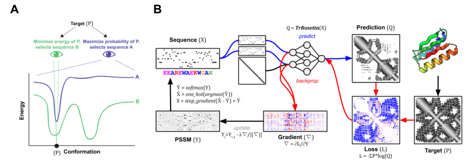

</img>

## trRosetta - Pytorch

Implementation of <a href="https://www.pnas.org/content/117/3/1496">trRosetta</a> and <a href="https://www.biorxiv.org/content/10.1101/2020.07.22.211482v1">trDesign</a> for Pytorch, made into a convenient package, for protein structure prediction and design. The concept of trDesign will also be abstracted into a wrapper in this repository, so that it can be applied to <a href="https://github.com/lucidrains/alphafold2">Alphafold2</a> once it is replicated. Please join the efforts there if you would like to see this happen!

The original repository can be found <a href="https://github.com/gjoni/trRosetta">here</a>

Update - <a href="https://github.com/aixander">Xander</a> has released <a href="https://github.com/Learn-Ventures/trdesign-pytorch">trDesign for Pytorch</a>!

## Install

```bash
$ pip install tr-rosetta-pytorch
```

## Usage

As a command-line tool, to run a structure prediction

```bash
$ tr_rosetta <input-file.a3m>
```

## Code

```python
import torch
from tr_rosetta_pytorch import trRosettaNetwork

model = trRosettaNetwork(
    filters = 64,
    kernel = 3,
    num_layers = 61
).cuda()

x = torch.randn(1, 526, 140, 140).cuda()

theta, phi, distance, omega = model(x)
```

## Citations

```bibtex
@article {Yang1496,
    author = {Yang, Jianyi and Anishchenko, Ivan and Park, Hahnbeom and Peng, Zhenling and Ovchinnikov, Sergey and Baker, David},
    title = {Improved protein structure prediction using predicted interresidue orientations},
    URL = {https://www.pnas.org/content/117/3/1496},
    eprint = {https://www.pnas.org/content/117/3/1496.full.pdf},
    journal = {Proceedings of the National Academy of Sciences}
}
```

```bibtex
@article {Anishchenko2020.07.22.211482,
    author = {Anishchenko, Ivan and Chidyausiku, Tamuka M. and Ovchinnikov, Sergey and Pellock, Samuel J. and Baker, David},
    title = {De novo protein design by deep network hallucination},
    URL = {https://www.biorxiv.org/content/early/2020/07/23/2020.07.22.211482},
    eprint = {https://www.biorxiv.org/content/early/2020/07/23/2020.07.22.211482.full.pdf},
    journal = {bioRxiv}
}
```
